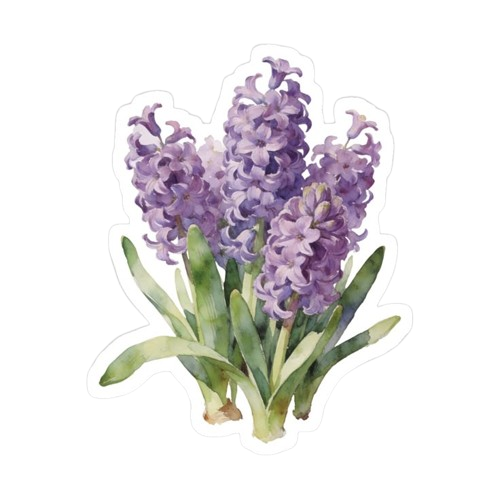

<div align="center">

# Mahnoor Qureshi

### 「 First-Year ICS Student • Always Learning • Coding」

*"Finding my way, One commit at a time."*

</div>

---

<table width="100%" style="border:3px solid #FFB6D9;border-radius:20px;border-collapse:collapse;background-color:#FFF7FB;">

<tr>

<td width="70%" valign="top" style="padding:28px;border-right:3px solid #FFD3E8;">
  
<h2 style="margin-top:0;color:#FF69B4;font-family:Arial,sans-serif;">
🌸 Hello, I'm Mahnoor Qureshi! 👋
</h2>

<p style="color:#D85D9D;font-size:15px;line-height:1.8;font-family:Arial,sans-serif;">

Welcome to my GitHub! I'm a first-year ICS student from Pakistan with a growing passion for technology and creativity. I enjoy turning ideas into interactive websites while continuously expanding my knowledge of programming. My current toolkit includes HTML, CSS, and JavaScript, and I'm learning Python and Git as I build more projects. Every project helps me improve my problem-solving skills and brings me one step closer to exploring fields like Artificial Intelligence, Machine Learning, Data Science, and modern Web Development. I'm always excited to learn, experiment, and create meaningful projects that combine functionality with clean, aesthetic design.

</p>
```


<hr style="border:1px solid #FFD3E8;">

<h3 style="color:#FF69B4;font-family:Arial,sans-serif;">
🌱 Currently Learning
</h3>

<ul style="color:#D85D9D;line-height:1.9;font-family:Arial,sans-serif;">
<li>HTML</li>
<li>CSS</li>
<li>JavaScript</li>
<li>Python</li>
<li>Git & GitHub</li>
</ul>

<h3 style="color:#FF69B4;font-family:Arial,sans-serif;">
🍇 Interests
</h3>

<p style="color:#D85D9D;font-family:Arial,sans-serif;line-height:1.8;">

Artificial Intelligence • Data Science • Machine Learning • Front-End Development • UI/UX Design

</p>

</td>

<td width="30%" align="center" valign="middle" style="padding:25px;">


</td>

</tr>

</table>

---

**⋆˚࿔ 💜 𝜗𝜚˚⋆ <b>Tech Stack:</b><br>
             

---


---

<table width="100%" style="width:100%; border:3px solid #FFB6D9; border-radius:20px; border-collapse:collapse; background-color:#FFF7FB;">

<tr>

<td width="35%" align="center" valign="middle" style="padding:40px; border-right:3px solid #FFD3E8;">



</td>

<td width="65%" valign="middle" style="padding:40px;">

<h2 style="margin-top:0; color:#FF69B4; font-family:Arial,sans-serif; font-size:36px;">
🚀 Current Projects
</h2>

<hr style="border:1px solid #FFD3E8;">

<p style="color:#D85D9D; font-size:22px; line-height:2.2; font-family:Arial,sans-serif;">
  
COMING SOON

</p>

</td>

</tr>

</table>


---


## 🌐 Connect With Me

<p align="center">

<a href="https://www.instagram.com/notyour_bruvv">

</a>

<a href="mailto:mahnoorq6767@gmail.com">

</a>

</p>

---

<div align="center">

> **"Code. Learn. Build. Repeat."**

⋆.˚🪻༘⋆ Thanks for visiting my profile!

</div>
